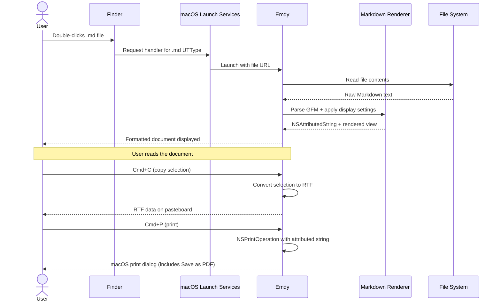
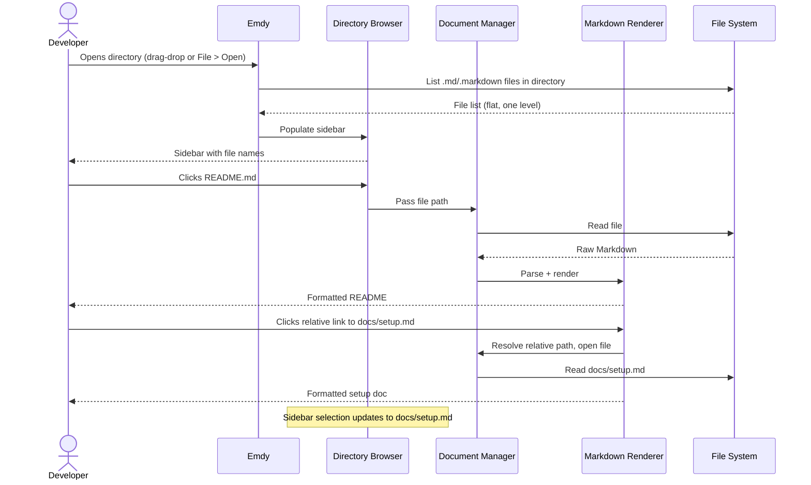
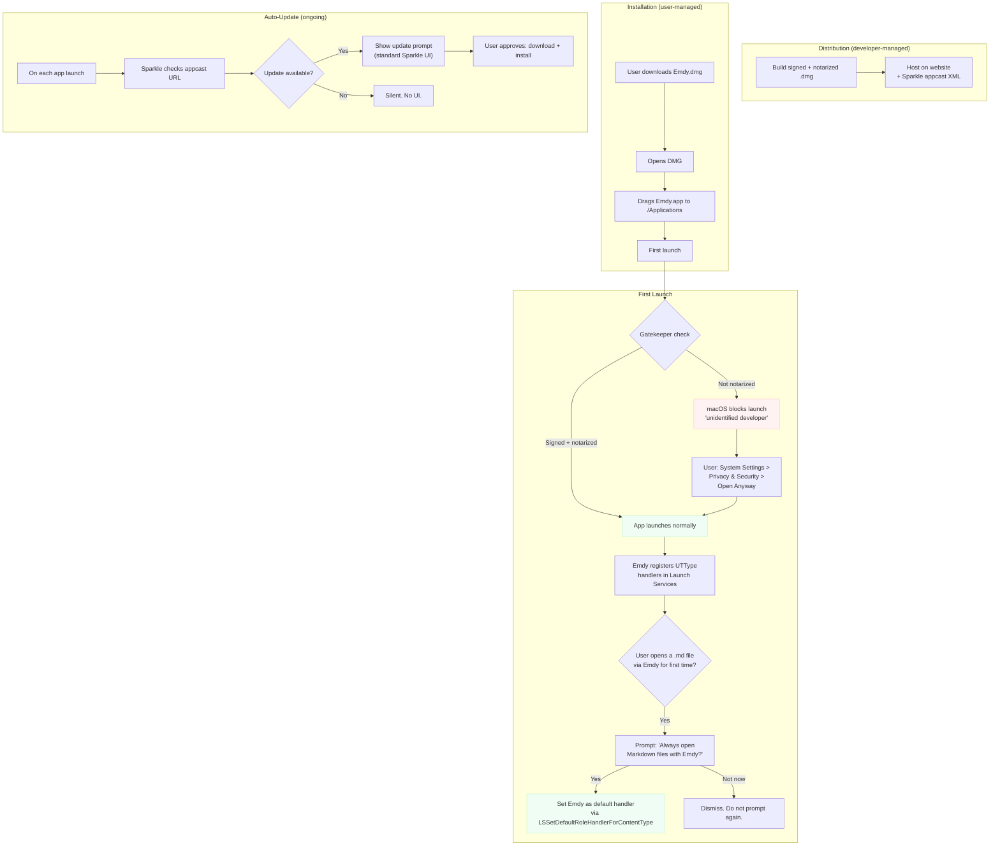
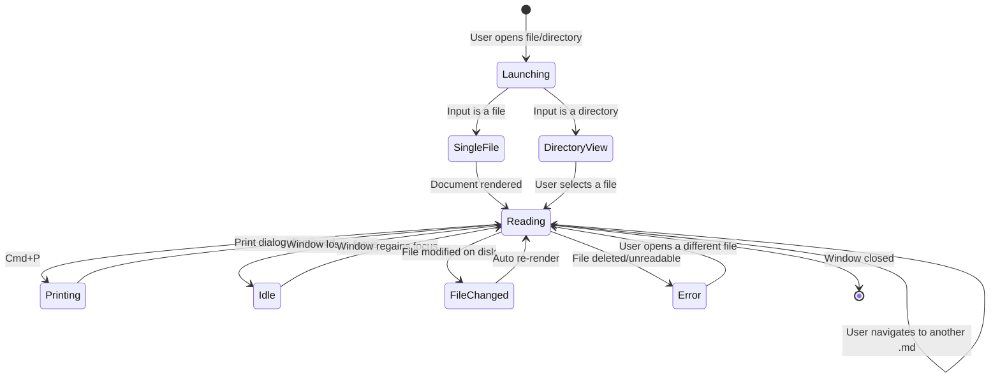

# Emdy — Service Blueprint

> Visual diagram: [service-blueprint.pen](service-blueprint.pen) (open in [pencil.dev](https://pencil.dev))

## System Overview

Emdy is a single-process, offline-first macOS application that renders Markdown files as formatted documents. It has no backend, no user accounts, and no network dependencies for core functionality. The system boundary is the user's Mac: Emdy reads from disk, renders in-process, and delegates to macOS system services for printing, pasteboard, file association, and updates.

This blueprint maps the full service across three layers — what the user sees (frontstage), what the app does behind the scenes (backstage), and the macOS and external services that make it possible (support processes) — for each user journey defined in the user journeys document.

---

## Blueprint 1: Non-Technical User Opens a Markdown File

The primary journey. A person who doesn't know what Markdown is double-clicks a `.md` file and needs to read it.

### Sequence diagram



### Layer-by-layer breakdown

| Step | Frontstage (user sees) | Backstage (app does) | Support processes |
|---|---|---|---|
| **1. File open** | Double-clicks `.md` file in Finder | App Shell receives file URL via `application(_:open:)` delegate. Determines it's a single file (not directory). | macOS Launch Services resolves UTType `net.daringfireball.markdown` to Emdy via Info.plist registration. |
| **2. File read** | Brief app launch (window appears) | Document Manager reads file from disk. Stores raw text in memory. Registers `NSFilePresenter` or `DispatchSource` to watch for external changes. | File system I/O. Sandbox (if any) file access permissions. |
| **3. Render** | Formatted document appears: headings, lists, tables, images | Markdown Renderer parses GFM via cmark-gfm. Builds NSAttributedString. Applies current font (defaults to sans-serif) and zoom level (defaults to 100%). Resolves image references. | cmark-gfm library (bundled). URLSession for remote images. |
| **4. Display** | Clean reading view. User scrolls, reads. | SwiftUI view displays the attributed string in a scroll view. Display Controls read font and zoom from UserDefaults. | macOS window management, scroll physics. |
| **5. Adjust display** | Cmd+/- to zoom. View > Font to switch. | Display Controls update UserDefaults. Renderer re-applies font/zoom to attributed string. View updates. | UserDefaults persistence. |
| **6. Copy as RTF** | Select text, Cmd+C. Paste into email produces formatted text. | Convert selected NSAttributedString range to RTF data via `rtf(from:documentAttributes:)`. Place on NSPasteboard as `NSPasteboard.PasteboardType.rtf`. | macOS pasteboard service. |
| **7. Print / PDF** | Cmd+P opens print dialog. "Save as PDF" button available. | Create NSPrintOperation from the attributed string. Present print panel. | macOS print subsystem. PDF generation is handled by the OS print dialog. |
| **8. File changes on disk** | Document re-renders. Subtle indicator (e.g., brief flash or "Updated" badge). | File watcher fires. Document Manager re-reads file. Renderer re-parses. View updates. Scroll position preserved if possible. | DispatchSource or NSFilePresenter. File system event notifications. |

### Failure modes at each step

| Step | What fails | User sees | Recovery |
|---|---|---|---|
| 1 | Emdy not registered as handler | TextEdit opens instead. Raw syntax. | User must right-click > Open With > Emdy. Emdy then prompts to become default. |
| 1 | Gatekeeper blocks launch | macOS dialog: "can't be opened because it is from an unidentified developer" | User goes to System Settings > Privacy & Security > Open Anyway. Website FAQ covers this. |
| 2 | File unreadable (permissions, missing) | Error message in document area: "Couldn't open this file." | Show the file path and a suggestion to check permissions. Offer to open in Finder. |
| 2 | File is very large (>10MB) | Slow render, possible hang | Stream-parse the file. Show a progress indicator. Consider a maximum supported file size. |
| 3 | Malformed Markdown | Partial rendering. Some elements may appear as raw text. | cmark-gfm is tolerant. Render what's parseable. Raw text is better than a blank screen. |
| 3 | Remote image fails to load | Placeholder where image should be. Alt text displayed if available. | Show a "could not load image" placeholder. Do not block document rendering on image loads. |
| 6 | Copy produces plain text instead of RTF | Formatted text doesn't paste into email/Docs | Verify RTF generation covers all attributed string attributes. Ensure pasteboard type is set correctly. |
| 8 | File deleted while open | Document still displayed but file is gone | Show a non-intrusive notice: "This file has been moved or deleted." Keep the rendered content visible. |

---

## Blueprint 2: Developer Opens a Project Directory

Secondary journey. A developer opens a folder containing multiple Markdown files and navigates between them.

### Sequence diagram



### Layer-by-layer breakdown

| Step | Frontstage | Backstage | Support processes |
|---|---|---|---|
| **1. Open directory** | Drags folder onto Emdy dock icon, or File > Open > selects folder | App Shell detects directory (not file). Passes to Directory Browser. | Finder drag-and-drop. NSOpenPanel directory selection. |
| **2. List files** | Sidebar appears with `.md` file names | Directory Browser calls FileManager to enumerate `.md` and `.markdown` files in the directory. One level deep, non-recursive. Sorts alphabetically. | FileManager directory enumeration. |
| **3. Select file** | Clicks a filename in sidebar. Document renders in main area. | Directory Browser sends file path to Document Manager. Same render pipeline as Blueprint 1. | Same as Blueprint 1 steps 2–4. |
| **4. Navigate via link** | Clicks a relative `.md` link inside the document (e.g., `[Setup](docs/setup.md)`) | Renderer intercepts the click. Resolves the relative path against the current document's directory. If the target is a `.md` file, passes to Document Manager. Sidebar selection updates. | Path resolution. File existence check. |
| **5. Navigate via link (external)** | Clicks an `https://` link inside the document | Renderer detects non-`.md` or absolute URL. Opens in default browser via `NSWorkspace.shared.open()`. | macOS Launch Services. Default browser. |

### Design decision: relative link navigation across directories

When a user opens a directory and clicks a relative link that points outside that directory (e.g., `../other-project/README.md`), the behavior needs a rule:

**Chosen approach:** Follow the link and render the file, but do not update the sidebar. The sidebar remains bound to the originally opened directory. The user can always click a sidebar item to return. This keeps the sidebar stable and predictable while allowing links to work naturally.

**Alternative considered:** Refuse to navigate outside the opened directory. Rejected because it breaks legitimate use cases (e.g., a monorepo where docs cross directory boundaries) and feels arbitrary to the user.

---

## Blueprint 3: Installation and File Association

This is the critical one-time journey that gates everything else.

### Process flow



### Technical answers to pending questions

**Gatekeeper handling:**
Notarization is sufficient for direct download distribution. Apple's notarization process scans the app for malware and issues a ticket that macOS recognizes. A properly signed and notarized DMG will launch without the "unidentified developer" warning on macOS 10.15+. A `.pkg` installer is not necessary — DMG with drag-to-Applications is simpler and matches the lightweight positioning. Code signing requires an Apple Developer ID certificate ($99/year).

**Default handler mechanism:**
Use `LSSetDefaultRoleHandlerForContentType` (or its modern equivalent in the `UniformTypeIdentifiers` framework) to register Emdy as the default handler for the `net.daringfireball.markdown` UTType. The prompt should be an `NSAlert` presented once — on the first occasion the user opens a `.md` file through Emdy (via Open With or drag-drop) and Emdy is not already the default. Store a `hasPromptedForDefault` flag in UserDefaults. If the user declines, do not prompt again.

**Update check timing:**
The Sparkle update check should happen after the document renders. The user opened the app to read a file — don't block or delay that with a network request. Sparkle's `SUUpdater` can be configured to check in the background after a short delay (e.g., 5 seconds post-launch). If an update is found, the prompt appears after the user has already started reading.

---

## Ecosystem and Dependency Map

### Actors

| Actor | Role | Interaction with Emdy |
|---|---|---|
| **Non-technical user** | Primary. Receives `.md` files, needs to read them. | Opens files via double-click, Finder, drag-drop. |
| **Developer** | Secondary. Previews project documentation. | Opens directories. Navigates between docs. |
| **File sender** (developer, AI tool, colleague) | Upstream. Produces the `.md` file. | No direct interaction. Their output is Emdy's input. |
| **macOS** | Platform. Provides Launch Services, file system, pasteboard, print, windowing. | Emdy depends on macOS for all system integration. |
| **Sparkle + update server** | Infrastructure. Delivers app updates. | Background check on launch. User-approved install. |
| **Remote image servers** | Optional dependency. Serves images referenced in documents. | URLSession fetches. Failure is non-blocking. |

### Dependency criticality

```
Core (app doesn't work without these):
├── macOS 14+ (Sonoma)
├── cmark-gfm (Markdown parsing)
├── File system access
└── Launch Services (file association)

Important (degraded experience without these):
├── Sparkle (no auto-updates → users stuck on old versions)
├── NSPasteboard (no RTF copy)
└── NSPrintOperation (no print/PDF)

Optional (app works fine without these):
├── Remote image loading (placeholder fallback)
├── Update server availability (silent failure)
└── UserDefaults (defaults reset to factory)
```

---

## State Model

### Application states



### Degradation tiers

| Tier | Condition | What still works | What breaks |
|---|---|---|---|
| **Fully operational** | All systems healthy | Everything | Nothing |
| **Offline** | No network connection | File reading, rendering, copy, print, font/zoom. All core features. | Remote images show placeholders. Sparkle update check fails silently. |
| **Large file** | File >5MB | Rendering works but may be slow | Scroll performance may degrade. Consider lazy rendering for documents beyond a threshold. |
| **Corrupt Markdown** | Malformed syntax | cmark-gfm renders what it can | Some elements appear as raw text. Tables with broken pipe alignment may render poorly. |
| **File access revoked** | Sandbox or permissions issue | App launches, window opens | Document area shows error message. User directed to check permissions. |

---

## Data Flow Summary

```
.md file on disk
    │
    ▼
┌─ Document Manager ──────────────────┐
│  Reads raw text                      │
│  Watches for changes                 │
└──────────┬───────────────────────────┘
           │ raw Markdown string
           ▼
┌─ Markdown Renderer ─────────────────┐
│  cmark-gfm parses GFM               │
│  Builds NSAttributedString           │
│  Applies font family + zoom level    │
│  Resolves local image paths          │
│  Fetches remote images (async)       │
│  Intercepts .md link clicks          │
└──────────┬───────────────────────────┘
           │ NSAttributedString
           ▼
    ┌──────┼──────────┐
    ▼      ▼          ▼
  View   Print    Pasteboard
(display) (Cmd+P)  (Cmd+C → RTF)
```

**Key data transformations:**
1. **Disk → Raw text:** FileManager reads UTF-8 encoded file contents
2. **Raw text → AST:** cmark-gfm parses Markdown into an abstract syntax tree
3. **AST → NSAttributedString:** Custom renderer walks the AST and builds styled attributed string with current font/zoom settings
4. **NSAttributedString → RTF:** `NSAttributedString.rtf(from:documentAttributes:)` for pasteboard
5. **NSAttributedString → Print:** `NSPrintOperation` renders the attributed string to the print subsystem

---

## Decisions Log

| Decision | Chosen | Rationale | Rejected alternative |
|---|---|---|---|
| **Distribution format** | DMG (drag to Applications) | Lightweight, matches product positioning, familiar to macOS users | `.pkg` installer — heavier, unnecessary for a single-app install |
| **Gatekeeper strategy** | Code signing + notarization | Eliminates the "unidentified developer" warning for most users. Required investment: Apple Developer ID ($99/year). | Unsigned — unacceptable for non-technical users who would be blocked at first launch |
| **Default handler prompt** | Once, on first `.md` open, dismissible | Respects user choice. Non-technical users need this to avoid falling back to TextEdit. Prompt stored in UserDefaults so it never reappears. | Prompt on every launch — annoying. Silent registration — user may not realize Emdy can be their default. |
| **Sparkle update timing** | After document renders (5s delay) | The user opened the app to read something. Don't interrupt that. | On launch before render — blocks the core task. |
| **Relative link scope** | Follow links outside opened directory | Enables natural cross-directory linking in monorepos and doc sites | Restrict to opened directory — breaks legitimate links, feels arbitrary |
| **File size handling** | Render synchronously up to ~5MB, consider lazy rendering beyond | Covers the vast majority of Markdown files. Documents above 5MB are rare. | Always lazy render — adds complexity for a case that almost never occurs |

---

## Open Questions

| Question | Blocking? | Notes |
|---|---|---|
| **Apple Developer ID:** Has one been obtained? | Yes — blocks notarization and distribution | $99/year. Required for code signing, notarization, and Sparkle updates. |
| **Update server hosting:** Where will the Sparkle appcast XML and DMG be hosted? | Yes — blocks auto-update | Any static file host works: GitHub Releases, S3, Cloudflare Pages, personal server. GitHub Releases is free and integrates with the existing repo. |
| **Website:** Where will users download Emdy? | Yes — blocks distribution | Needs a landing page with download link, "how to install" instructions, and the Gatekeeper FAQ. Can be a single-page site hosted alongside the repo (GitHub Pages) or a simple domain. |
| **UTType registration:** Does `net.daringfireball.markdown` cover all `.md` variants? | No — needs verification | Some files use `.markdown`, `.mdown`, `.mkd`. The Info.plist UTType declaration should cover all common extensions. Test against real-world files. |
| **Accessibility:** Has VoiceOver compatibility been considered? | No — but should be addressed in Phase 1 | NSAttributedString rendering in SwiftUI should get baseline VoiceOver support for free. Needs testing with actual screen reader. Heading navigation, link announcement, and table reading may need explicit work. |
