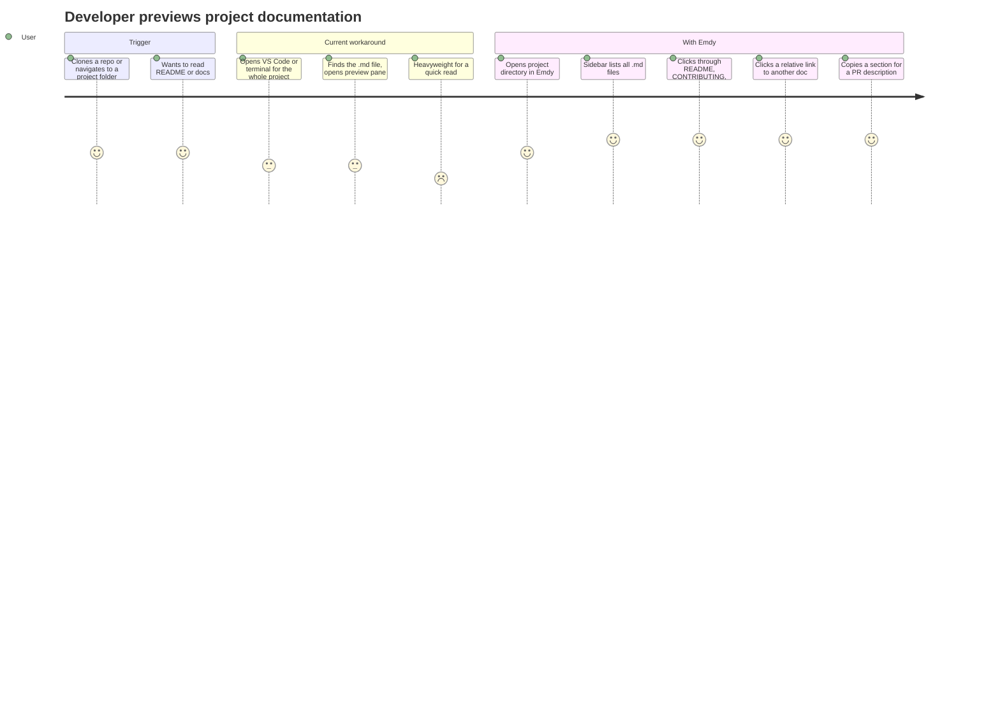
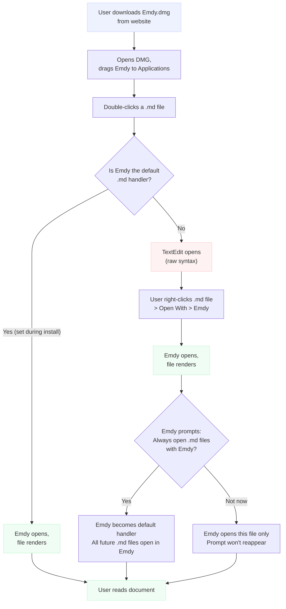
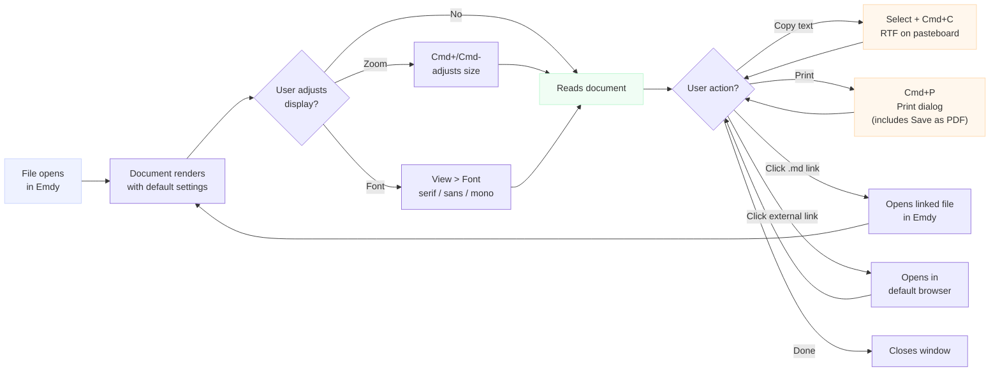

# Emdy — User Journeys

> Visual diagrams: [user-journeys.pen](user-journeys.pen) (open in [pencil.dev](https://pencil.dev))

## Journey 1: Non-Technical Person Receives a Markdown File

This is the primary use case. A marketing manager, PM, executive, or other non-technical professional receives a `.md` file — from a developer, from an AI tool, or as part of a project handoff — and needs to read it.

### Journey map

```mermaid
journey
    title Marketing manager receives a project outline (.md) from a developer
    section Trigger
      Receives .md file via email or Slack: 3: User
      Downloads file to Desktop: 3: User
    section First encounter (without Emdy)
      Double-clicks file: 2: User
      TextEdit opens, shows raw syntax: 1: User
      Sees # symbols, ** markers, pipe tables: 1: User
      Confused, frustrated: 1: User
      Googles "how to open md file on mac": 2: User
    section Discovery
      Finds Emdy via search or developer recommendation: 3: User
      Downloads from website: 3: User
      Installs (drag to Applications): 4: User
    section First use
      Double-clicks .md file again: 4: User
      Emdy opens, file renders beautifully: 5: User
      Reads the document: 5: User
      Adjusts font size: 5: User
      Copies a section to paste in email: 5: User
    section Ongoing
      Receives another .md file weeks later: 3: User
      Double-clicks, Emdy opens automatically: 5: User
      Already familiar, reads immediately: 5: User
```

### Phase breakdown

#### Phase 1: Trigger — "Someone sent me a file"

**Context:** The user receives a `.md` file they didn't ask for in a format they didn't choose. It arrives via email attachment, Slack upload, Google Drive link, or a GitHub notification. They don't know what Markdown is. They just see a file they need to read.

**Emotional state:** Neutral, task-oriented. They have a job to do — read this document and respond.

**What happens today (without Emdy):**
- They double-click the file
- macOS opens it in TextEdit (or Xcode if installed)
- They see raw Markdown syntax: `# Project Outline`, `**Q3 Goals**`, tables made of pipes
- Confusion turns to frustration — "Why can't I just read this?"
- They either ask the sender to resend as PDF, or Google for a solution

**Friction points:**
- macOS provides no formatted preview of `.md` files
- TextEdit is the default handler and shows raw text
- The user doesn't know the term "Markdown" so they don't know what to search for
- Every suggested solution (VS Code, Typora, browser extensions) is overkill for the task

#### Phase 2: Discovery — "Someone told me about this app"

**Context:** The user finds Emdy through one of these paths:
1. The developer who sent the file recommends it: "Install Emdy, it'll open those files"
2. They Google "how to open .md file on Mac" and find Emdy's website
3. A colleague who already has it says "just get Emdy"

**Emotional state:** Skeptical but hopeful. They've been burned by bloated software before.

**What needs to happen:**
- The website communicates what Emdy does in one sentence
- Download is a single click — DMG, drag to Applications, done
- The install process feels as lightweight as the product promise

**Friction points:**
- Discovery is the hardest part. Non-technical users don't search for "Markdown reader" — they search for "how to open .md file" or "weird file from developer"
- macOS Gatekeeper may show a warning for a non-App Store app ("can't be opened because it is from an unidentified developer"). This is a significant trust barrier for non-technical users
- If install takes more than 60 seconds, it doesn't match the "I just need to read one file" urgency

#### Phase 3: First use — "Oh, that's what it says"

**Context:** The user opens the `.md` file again (or Emdy registers as the default handler and it opens automatically on next double-click). The document renders as clean, formatted text.

**Emotional state:** Relief, then satisfaction. The document finally looks like a document.

**What the user experiences:**
1. Double-click the `.md` file
2. Emdy opens in under a second
3. The document renders with clear headings, formatted lists, readable tables
4. They read the content — this is the core value moment
5. They might increase the font size, switch to a serif font
6. They select a section, Cmd+C, paste into an email — it pastes formatted
7. They close the app

**Friction points:**
- If Emdy doesn't register as the default `.md` handler, the user still gets TextEdit on double-click and doesn't think to use "Open With"
- First-launch Gatekeeper warning (see above)
- If the document has images referencing remote URLs, a slow load could break the "instant" feeling

#### Phase 4: Ongoing — "It just works now"

**Context:** Weeks or months later, the user receives another `.md` file. They've forgotten about Emdy — they just double-click the file and it opens, formatted.

**Emotional state:** The app is invisible. That's the goal.

**What needs to happen:**
- Emdy stays registered as the default `.md` handler across macOS updates
- Sparkle updates keep the app current without the user thinking about it
- Open Recent works so they can pull up a document they read last week

---

## Journey 2: Developer Previewing Project Markdown Files

Secondary use case. A developer wants to read `README.md`, `CHANGELOG.md`, or documentation files without opening an IDE.

### Journey map



### Phase breakdown

#### Phase 1: Trigger — "I need to read these docs"

**Context:** The developer has cloned a repo, is evaluating a library, or is reviewing their own project's documentation. They want to read — not edit — the Markdown files.

**Emotional state:** Task-focused. They want a quick read, not to open a full IDE.

**Current workarounds:**
- Open VS Code, wait for it to load the project, find the file, open the Markdown preview pane
- Use `cat README.md` in the terminal (raw syntax)
- Open on GitHub in a browser (requires internet, navigating to the repo)

#### Phase 2: With Emdy — "Open the folder, read the docs"

**Context:** The developer drags the project folder onto Emdy (or right-clicks > Open With > Emdy).

**What the user experiences:**
1. Emdy opens with a sidebar listing all `.md` files in the directory
2. They click `README.md` — it renders in the main view
3. They click `CONTRIBUTING.md` in the sidebar
4. A relative link in the README points to `docs/setup.md` — clicking it opens that file within Emdy
5. They select a section, Cmd+C, paste into a PR description — formatted
6. They Cmd+P to print the architecture doc for a meeting

**Why this works for developers:**
- Faster than opening an IDE when the goal is reading, not coding
- The sidebar provides navigation across a project's docs
- Relative `.md` links working internally means the docs read like a connected site
- RTF copy produces formatted text for pasting into GitHub, Jira, Confluence, Slack

---

## Journey 3: First-time install and file association

This is a critical micro-journey that gates both primary use cases.

### Flow diagram



### Key design decisions for this flow

**Gatekeeper warning:** On first launch, macOS may show "Emdy can't be opened because it is from an unidentified developer." The app must be properly code-signed and notarized to avoid this. If it still appears, the website should include a short "first launch" help section with screenshots showing how to allow it.

**Default handler prompt:** When Emdy opens a `.md` file for the first time and is not the default handler, it should offer (once) to become the default. The prompt should be conversational, not technical: "Want to always open Markdown files with Emdy?" with "Yes" and "Not now" options. "Not now" means the prompt doesn't appear again — respect the user's choice.

**Open With discoverability:** Non-technical users may not know about right-click > Open With. The website and any error-state messaging should include this instruction explicitly.

---

## Journey 4: Reading a document end-to-end

The core reading experience, screen by screen.

### Flow diagram



---

## Emotional arc summary

| Phase | Non-technical user | Developer |
|---|---|---|
| **Trigger** | Confused — "What is this file?" | Mildly annoyed — "I don't want to open my IDE for this" |
| **Without Emdy** | Frustrated — raw syntax, no clear path | Resigned — opens VS Code anyway |
| **Discovery** | Hopeful but skeptical | Interested — "lightweight viewer, nice" |
| **First use** | Relieved — "Oh, it's just a document" | Satisfied — fast, does what it says |
| **Ongoing** | Invisible — file opens, they read it | Habitual — quicker than alternatives |

## Friction points ranked by severity

| # | Friction point | Severity | Who it affects | Mitigation |
|---|---|---|---|---|
| 1 | macOS Gatekeeper blocks first launch | High | Everyone (non-App Store distribution) | Code signing + notarization. Website FAQ with screenshots. |
| 2 | Emdy not set as default `.md` handler | High | Non-technical users | Prompt on first open. Clear website instructions for "Open With." |
| 3 | User doesn't know what a `.md` file is | Medium | Non-technical users | Website SEO for "how to open .md file mac." App describes itself as a "document reader" not a "Markdown viewer." |
| 4 | Remote images load slowly | Low | Everyone | Show a loading placeholder. Alt text fallback. |
| 5 | File changed on disk while reading | Low | Developers | Auto-refresh with subtle indicator. |

## Pending questions for systems-architect

- How should Emdy handle the Gatekeeper flow technically? Is notarization sufficient, or should we consider a signed installer (`.pkg`) instead of a DMG?
- What's the right mechanism for the "set as default handler" prompt — `LSSetDefaultRoleHandlerForContentType` or an `NSAlert` that triggers a system API?
- Should the auto-update check happen before or after the document renders on launch?
